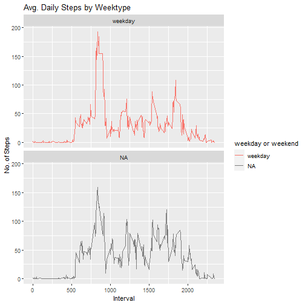

## Assignment

This assignment will be described in multiple parts. You will need to write a report that answers the questions detailed below. Ultimately, you will need to complete the entire assignment in a single R markdown document that can be processed by knitr and be transformed into an HTML file.

Commit containing full submission

#1 Code for reading in the dataset and/or processing the data
The data can be download links[data](https://www.coursera.org/learn/reproducible-research/peer/gYyPt/course-project-1)


```r
x<-unzip("repdata_data_activity.zip")
steps <- read.csv("activity.csv", header=TRUE, sep=",")
steps1<-data.frame(steps)
steps1$date <- as.Date(steps$date, format="%Y-%m-%d")
steps1$interval <- as.factor(steps$interval)
totalsteps<-aggregate(steps~date,steps1,sum)
library(ggplot2)
```

#2 Histogram of the total number of steps taken each day


```r
ggplot(totalsteps, aes(x = steps)) + geom_histogram() +
        labs(title = "Total Steps for Day", x = "Steps", y = "Frequency")
```

```
## `stat_bin()` using `bins = 30`. Pick better value with `binwidth`.
```


#2.1 plot of total number os steps each day, without NA

```r
stepsforday<-aggregate(steps1$steps, by=list(date=steps1$date),FUN=sum)
plot(totalsteps$steps~totalsteps$date, main="Total Steps for Day", 
     xlab = "day", ylab = "total steps")
```


#3 Mean and median number of steps taken each day

```r
mean(totalsteps$steps,na.rm = TRUE)
```

```
## [1] 10766.19
```

```r
median(totalsteps$steps,na.rm=TRUE)
```

```
## [1] 10765
```

#4 Time series plot of the average number of steps taken

```r
steps_interval <- aggregate(steps ~ interval, steps, mean)
plot(steps_interval$interval,steps_interval$steps, type="l", xlab="Interval", 
     ylab="Avg. Steps",main="Average Number of Steps per Day by Interval")
```


#5 The 5-minute interval that, on average, contains the maximum number of steps

```r
maxInt <- steps_interval[which.max(steps_interval$steps),]
maxInt
```

```
##     interval    steps
## 104      835 206.1698
```

#6 Code to describe and show a strategy for imputing missing data

```r
missing<-sum(is.na(steps1$steps))
missing
```

```
## [1] 2304
```

#7 Histogram of the total number of steps taken each day after missing values are imputed
Devise a strategy for filling in all of the missing values in the dataset. The strategy does not need to be sophisticated. For example, you could use the mean/median for that day, or the mean for that 5-minute interval, etc.
Create a new dataset that is equal to the original dataset but with the missing data filled in.

```r
steps2 <- steps1
index_of_na <- which(is.na(steps2$steps))
for (i in index_of_na) {
        steps2$steps[i] <- with(steps_interval, 
                                    steps[interval = steps2$interval[i]])
}
```

#7.1 Make a histogram of the total number of steps taken each day and Calculate and report the mean and median total number of steps taken per day. 

```r
totalsteps2 <- aggregate(steps ~ date, data = steps2, FUN=sum)
colnames(totalsteps2) <- c("date", "steps")
ggplot(totalsteps2, aes(x = steps)) + 
        geom_histogram() + 
        labs(title = "Steps for Day", x = "Steps for Day", y = "Frequency")
```

```
## `stat_bin()` using `bins = 30`. Pick better value with `binwidth`.
```


```r
mean(totalsteps2$steps)
```

```
## [1] 10766.19
```

```r
median(totalsteps2$steps)
```

```
## [1] 10766.19
```
#8 Panel plot comparing the average number of steps taken per 5-minute interval across weekdays and weekends

```r
activityDT <- data.table::fread(input = "activity.csv")
activityDT[, date := as.POSIXct(date, format = "%Y-%m-%d")]
activityDT[, `Day of Week`:= weekdays(x = date)]
activityDT[grepl(pattern = "lunes|martes|miercoles|jueves|viernes", 
                 x = `Day of Week`), "weekday or weekend"] <- "weekday"
activityDT[grepl(pattern = "Sabado|Domingo", x = `Day of Week`), "weekday or weekend"] <- "weekend"
activityDT[, `weekday or weekend` := as.factor(`weekday or weekend`)]
activityDT[is.na(steps), "steps"] <- activityDT[, c(lapply(.SD, median, 
                                na.rm = TRUE)), .SDcols = c("steps")]
IntervalDT <- activityDT[, c(lapply(.SD, mean, na.rm = TRUE)),
                .SDcols = c("steps"), by = .(interval, `weekday or weekend`)] 

ggplot(IntervalDT , aes(x = interval , y = steps, color=`weekday or weekend`)) +
        geom_line() + labs(title = "Avg. Daily Steps by Weektype", 
                           x = "Interval", y = "No. of Steps") + 
        facet_wrap(~`weekday or weekend` , ncol = 1, nrow=2)
```


